# 🛠️ DevOps Troubleshooting Master Cheat Sheet
> Common Issues, Flow Diagrams, Commands & Interview Q&A

---

## 📋 Table of Contents
1. [Application Not Working](#1-application-not-working)
2. [Website Not Accessible](#2-website-not-accessible)
3. [SSH Connection Failed](#3-ssh-connection-failed)
4. [High CPU Usage](#4-high-cpu-usage)
5. [High Memory Usage](#5-high-memory-usage)
6. [Disk Full](#6-disk-full)
7. [Docker Container Down](#7-docker-container-down)
8. [Kubernetes Pod CrashLoopBackOff](#8-kubernetes-pod-crashloopbackoff)
9. [Git Push Failed](#9-git-push-failed)
10. [Jenkins Build Failed](#10-jenkins-build-failed)
11. [AWS EC2 Troubleshooting](#11-aws-ec2-troubleshooting)
12. [Service Not Restarting](#12-service-not-restarting)
- [Universal Troubleshooting Formula](#-universal-troubleshooting-formula)
- [Golden Commands](#-golden-commands-memorize)
- [Common Log Locations](#-common-log-locations)
- [Interview Tips](#-interview-tips)

---

## 1. Application Not Working

### Flow Diagram

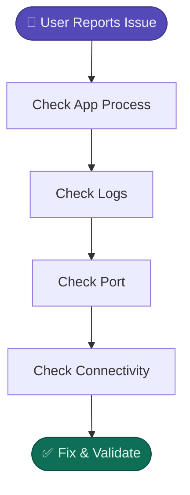

### Commands
```bash
ps -ef | grep app
top / htop
systemctl status app
journalctl -u app -f
tail -f /var/log/app.log
ss -tulpn
curl localhost:8080
```

### Interview Q
> **Q: Application is down. Where do you start?**

---

## 2. Website Not Accessible

### Flow Diagram

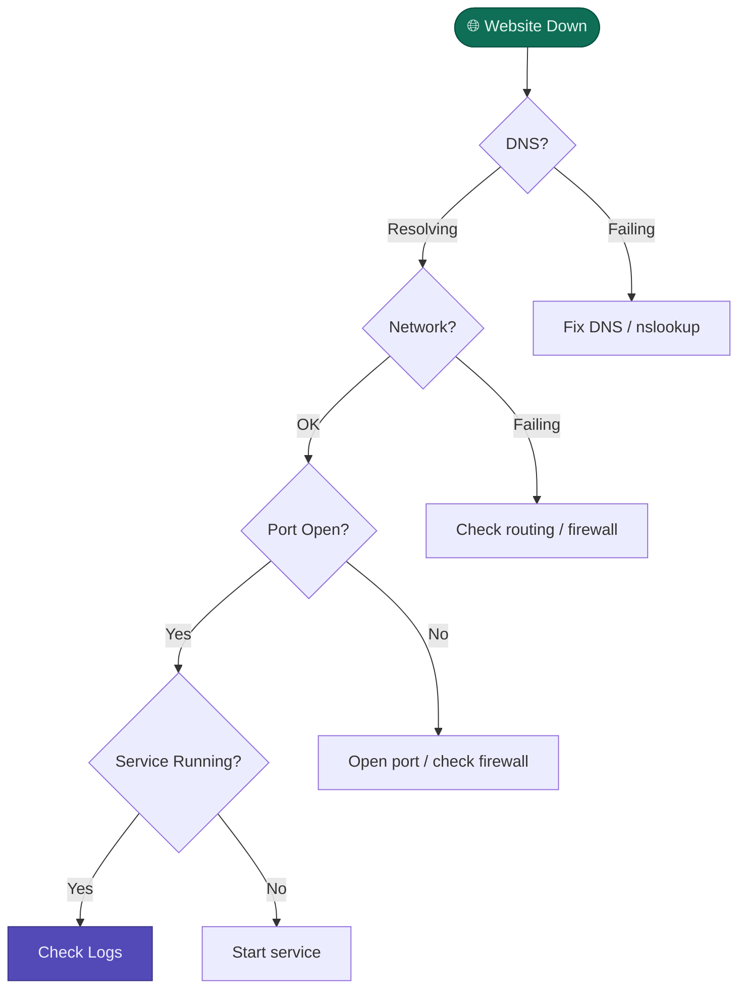

### Commands
```bash
ping google.com
nslookup example.com
dig example.com
curl -I website.com
ss -tulpn
netstat -tulpn
systemctl status nginx
```

### Interview Q
> **Q: What will you check if website is not accessible?**

---

## 3. SSH Connection Failed

### Flow Diagram

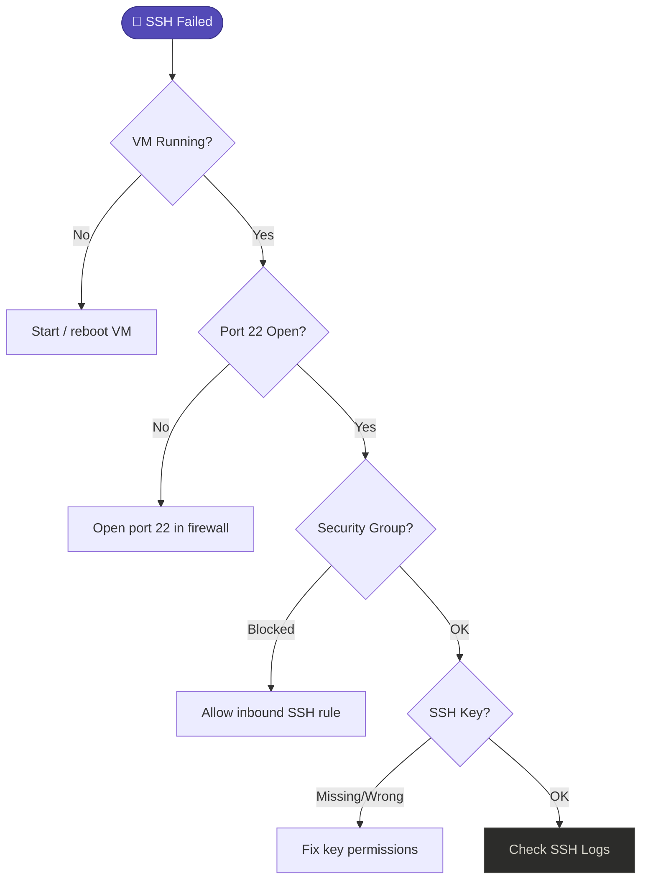

### Commands
```bash
ping SERVER_IP
nc -zv SERVER_IP 22
ssh -i key.pem user@ip
sudo systemctl status ssh
sudo journalctl -u ssh
```

### Interview Q
> **Q: You are unable to SSH into EC2. How will you troubleshoot?**

---

## 4. High CPU Usage

### Flow Diagram

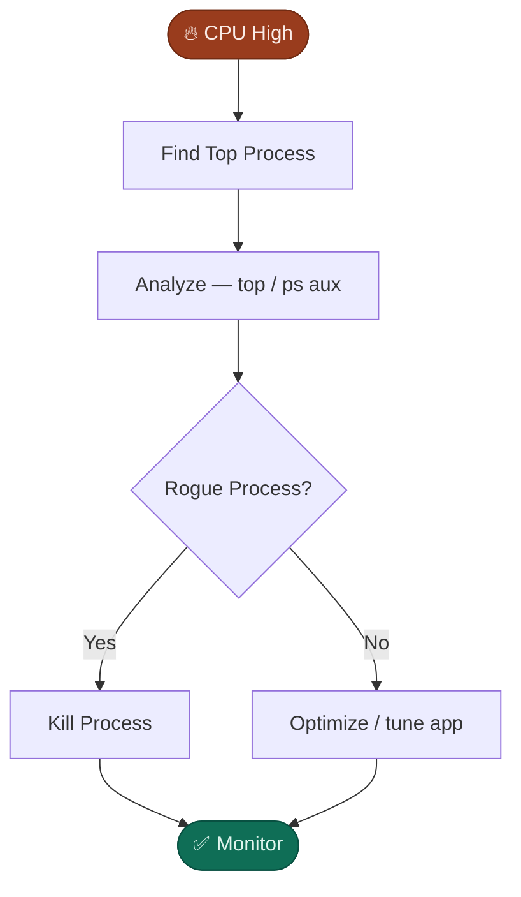

### Commands
```bash
top
ps aux --sort=-%cpu
ps -ef
kill PID
kill -9 PID
```

### Interview Q
> **Q: CPU is 100%. How will you find the cause?**

---

## 5. High Memory Usage

### Flow Diagram

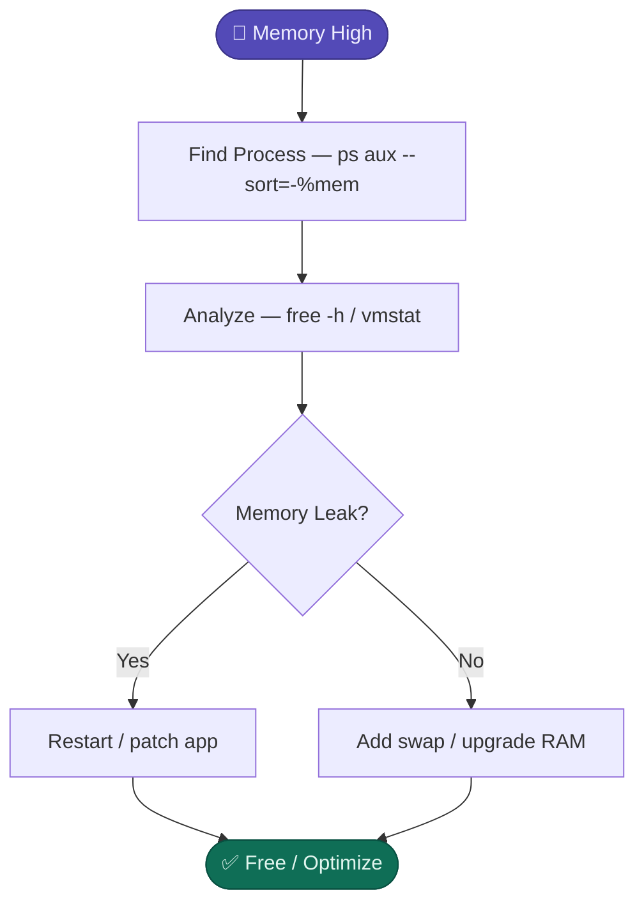

### Commands
```bash
free -h
top
ps aux --sort=-%mem
vmstat
cat /proc/meminfo
```

### Interview Q
> **Q: System is slow due to high memory usage. What to do?**

---

## 6. Disk Full

### Flow Diagram

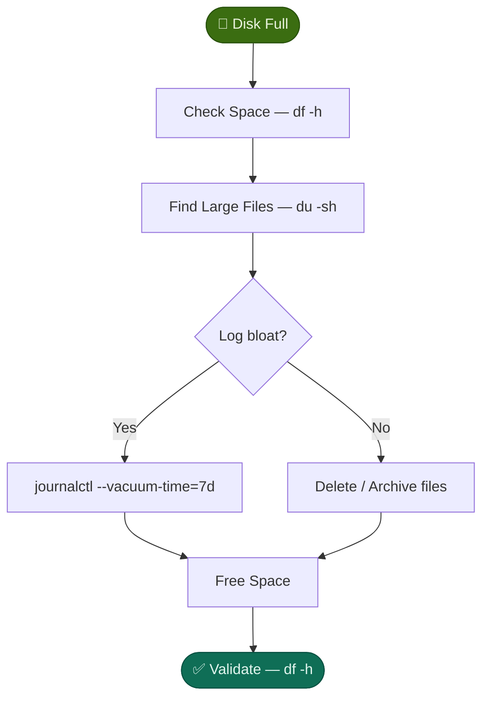

### Commands
```bash
df -h
du -sh *
find / -size +500M
sudo du -ahx / | sort -rh | head -20
journalctl --vacuum-time=7d
```

### Interview Q
> **Q: Disk is full. How will you free up space?**

---

## 7. Docker Container Down

### Flow Diagram

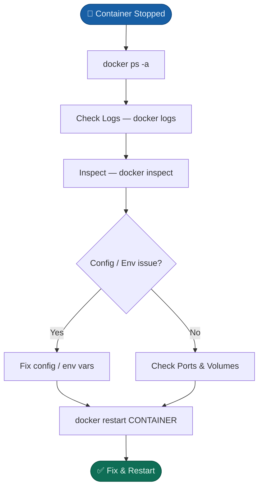

### Commands
```bash
docker ps -a
docker logs CONTAINER
docker inspect CONTAINER
docker exec -it CONTAINER bash
docker restart CONTAINER
```

### Interview Q
> **Q: Container exits immediately. How will you troubleshoot?**

---

## 8. Kubernetes Pod CrashLoopBackOff

### Flow Diagram

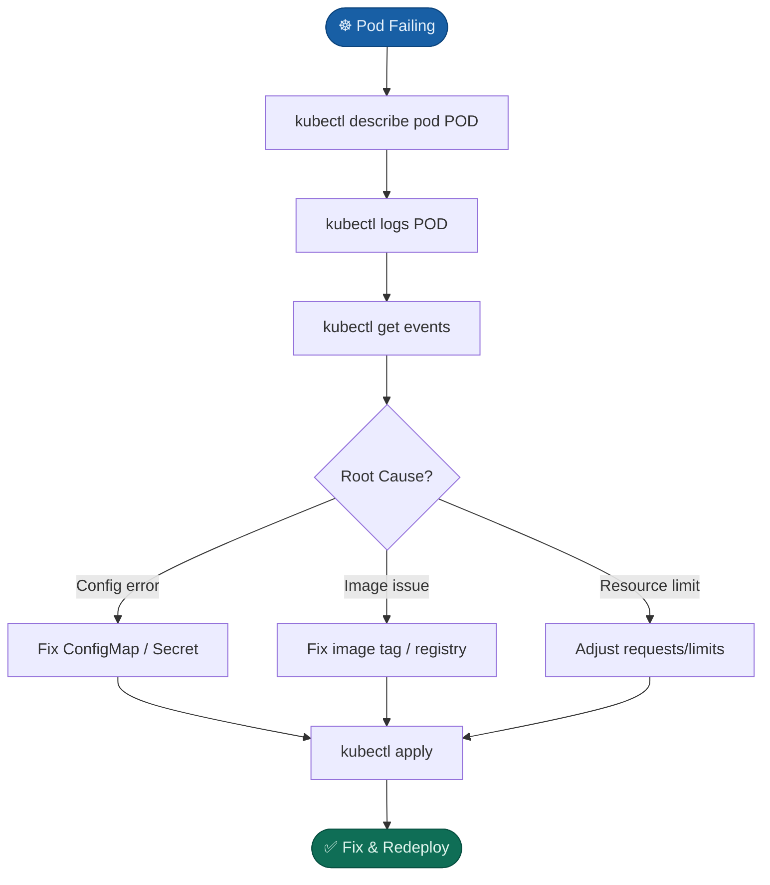

### Commands
```bash
kubectl get pods
kubectl describe pod POD
kubectl logs POD
kubectl get events
kubectl exec -it POD --bash
```

### Interview Q
> **Q: Pod is in CrashLoopBackOff. How will you fix it?**

---

## 9. Git Push Failed

### Flow Diagram

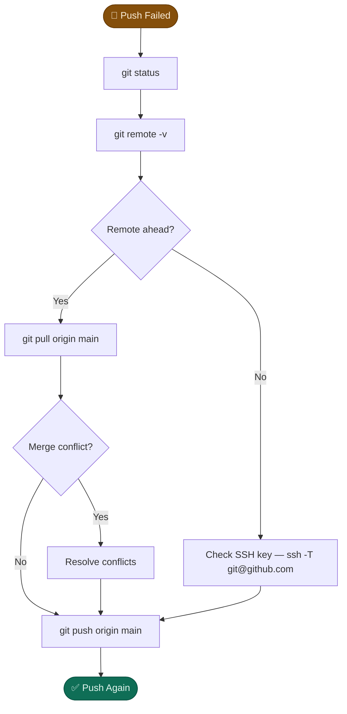

### Commands
```bash
git status
git remote -v
git pull origin main
git push origin main
ssh -T git@github.com
```

### Interview Q
> **Q: Why is push rejected? How will you fix it?**

---

## 10. Jenkins Build Failed

### Flow Diagram

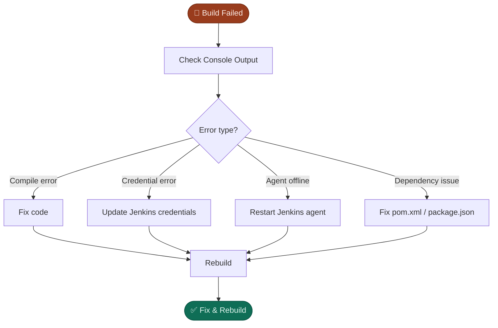

### Commands
```bash
# Check Console Output in Jenkins UI
systemctl status jenkins
journalctl -u jenkins -f
docker logs jenkins
```

### Interview Q
> **Q: Jenkins build failed. What will you check?**

---

## 11. AWS EC2 Troubleshooting

### Flow Diagram

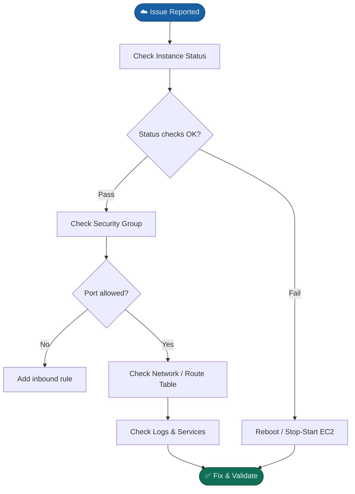

### Commands
```bash
ping SERVER_IP
ss -tulpn
systemctl status nginx
aws ec2 describe-instances
aws ec2 describe-security-groups
```

### Interview Q
> **Q: EC2 is not reachable. How will you troubleshoot?**

---

## 12. Service Not Restarting

### Flow Diagram

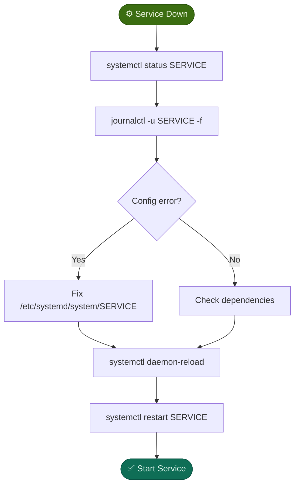

### Commands
```bash
systemctl status SERVICE
journalctl -u SERVICE -f
cat /etc/systemd/system/SERVICE
systemctl daemon-reload
systemctl restart SERVICE
```

### Interview Q
> **Q: Service fails to start even after restart?**

---

## 🔄 Universal Troubleshooting Formula


1. Understand the issue
2. Reproduce the issue
3. Check logs
4. Check process / service
5. Check networking
6. Check resources (CPU, RAM, Disk)
7. Identify root cause
8. Fix the issue
9. Validate the fix
10. Document & Monitor

---

## ⭐ Golden Commands (Memorize)

| Category | Commands |
|----------|----------|
| **System** | `top / htop`, `df -h`, `du -sh`, `free -h`, `ps -ef`, `ss -tulpn`, `netstat -tulpn` |
| **Network** | `ping`, `curl`, `nslookup`, `curl localhost` |
| **Logs** | `journalctl -xe`, `systemctl status`, `tail -f` |
| **Docker** | `docker ps -a`, `docker logs`, `docker inspect` |
| **Kubernetes** | `kubectl get pods`, `kubectl describe pod`, `kubectl logs` |
| **Misc** | `grep`, `cat` |

---

## 📁 Common Log Locations

| Log | Path |
|-----|------|
| Syslog | `/var/log/syslog` |
| Messages | `/var/log/messages` |
| Auth | `/var/log/auth.log` |
| Nginx Error | `/var/log/nginx/error.log` |
| Apache Error | `/var/log/apache2/error.log` |
| Jenkins | `/var/log/jenkins/jenkins.log` |
| Docker | `/var/log/docker.log` |
| Bash History | `~/.bash_history` |

---

## 💡 Interview Tips

- ✅ Stay calm and gather information.
- ✅ Always check logs first.
- ✅ Narrow down the problem.
- ✅ Explain your thought process.
- ✅ Communicate clearly.
- ✅ Document and learn.

---

> 💪 *The more you troubleshoot, the better you become!*
